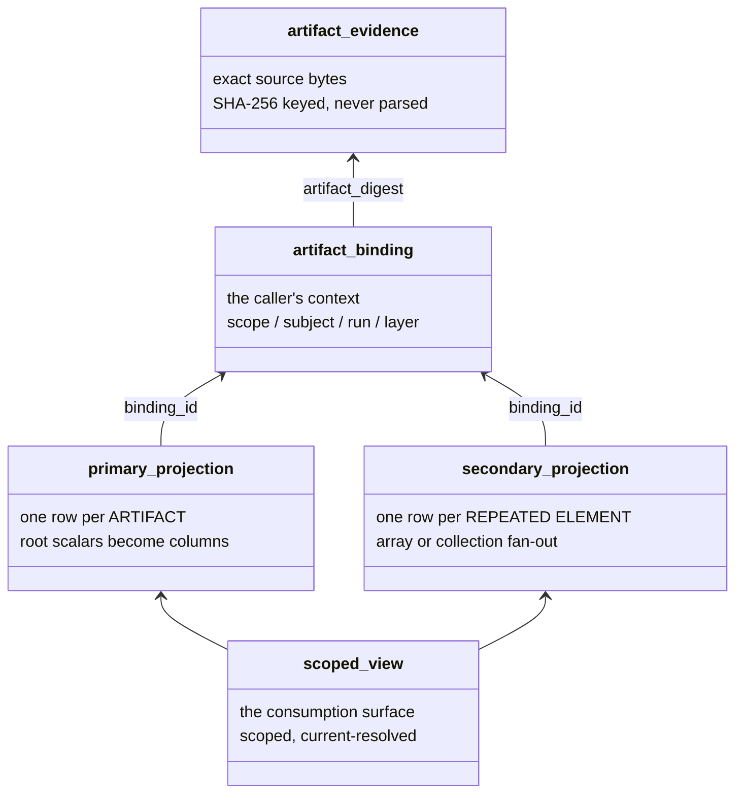
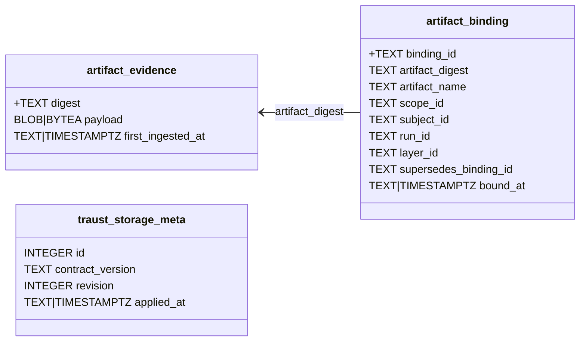

# storage/v1 DDL — table model

**45 tables, 30 views, two dialects.** SQLite and
PostgreSQL declare the same tables, the same column names, in the same
order — verified by the generator, zero differences. Only TYPES diverge where the dialect
demands it, shown as `sqlite|postgres` (`TEXT|JSONB`, `REAL|DOUBLE PRECISION`,
`INTEGER|BIGINT`). PostgreSQL relations live in the fixed `traust_storage` schema;
SQLite uses the database file as its namespace.

Legend: `+` primary key, arrows are declared foreign keys.

## How the layers relate

A view composes columns these tables provide. It does not mine a JSON
blob for fields the DDL never declared — see `storage/v1/README.md`,
"The schema is the reference".

## Artifact classes

`profiles.json` gives every family a binding class, which fixes what
context its rows can carry.

| class | count | families |
|---|---|---|
| **aggregate** | 2 | `impact-analysis`, `isolation-review` |
| **layer-bound** | 1 | `layer` |
| **run-bound** | 17 | `adapter-result`, `cloud-config-audit`, `cloud-config-findings-current`, `compliance-assessment`, `doc-variance`, `operator-priv-profile`, `pqc-blockers`, `pqc-facts`, `pqc-readiness`, `refuted-register`, `remediation`, `report`, `threat-model`, `triage`, `validation`, `verification`, `vuln-findings` |
| **scope-ref** | 11 | `adr-registry`, `attack-mapping`, `benchmark-target`, `compliance-mapping`, `compliance-scope`, `corpus-registry`, `fleet-fix`, `org-parameters`, `pqc-decision-tree`, `risk-rating-methodology`, `sla-policy` |

## Views

`advisory_exposure`, `attack_coverage`, `binding_current`, `census_exposure`, `census_population`, `compliance_posture`, `current_finding`, `distinct_exposure`, `exposure_trend`, `finding_first_seen`, `finding_sla`, `finding_timeline`, `findings_summary`, `hardening_findings`, `open_findings`, `operator_privilege`, `ownership_current`, `pattern_exposure`, `pqc_posture`, `pqc_readiness_rollup`, `remediation_current`, `report_current`, `sla_clock`, `sla_threshold`, `threat_current`, `threat_exposure`, `validation_current`, `validation_exposure`, `verification_current`, `verification_regression_current`

---

### Core — evidence, binding, metadata (3)

### Secondary fan-out projections — one row per repeated collection element (11)

A repeated collection element is one object from an artifact array or equivalent
collection—for example, one finding from `findings[]` or one event from
`events[]`. Each row remains tied to the source artifact through `binding_id`
and `artifact_digest`, plus its element key such as `finding_id` or `event_id`.
Nested structures that are not fanned out remain in their declared JSON/JSONB
columns; this does not mean one row per arbitrary JSON value.

```mermaid
classDiagram
  direction LR
  class attack_chain {
    «fan-out»
    +TEXT binding_id
     TEXT artifact_digest
    +TEXT chain_id
     TEXT name
     TEXT entry_point
     TEXT terminal_asset
     TEXT|JSONB mitre_attack_refs
     TEXT|JSONB steps
     TEXT verdict
     TEXT narrative
  }
  class cloud_config_finding {
    «fan-out»
    +TEXT binding_id
     TEXT artifact_digest
    +TEXT finding_id
     TEXT title
     TEXT severity
     TEXT fingerprint
     TEXT validation_status
     TEXT check_id
     TEXT framework
     TEXT provider
     TEXT status
     TEXT scanner_severity
     TEXT validity
     TEXT resolution
     TEXT assurance
     TEXT last_updated
     INTEGER conflict
     INTEGER fp_overridden
     INTEGER fp_reassertion_blocked
     INTEGER refuted_awaiting_signoff
     TEXT|JSONB severity_override
     TEXT rationale
     TEXT remediation
     TEXT cwe
     TEXT|JSONB control_refs
     TEXT|JSONB locations
     TEXT|JSONB fact_ids
     TEXT|JSONB external_correlation
     TEXT effective_severity
     TEXT fingerprint_algo
     TEXT isolation_boundary
     TEXT|JSONB isolation_dimensions
  }
  class compliance_result {
    «fan-out»
    +TEXT binding_id
     TEXT artifact_digest
    +TEXT framework
    +TEXT control_id
     TEXT title
     TEXT classification
     TEXT verdict
     TEXT verdict_source
     TEXT check_id
     TEXT reason
     TEXT narrative
     TEXT|JSONB evidence
     TEXT|JSONB override
     TEXT|JSONB n_pass_agreement
  }
  class layer_event {
    «fan-out»
    +TEXT binding_id
     TEXT artifact_digest
    +TEXT event_id
     TEXT finding_ref
     TEXT fingerprint
     TEXT fingerprint_algo
     TEXT recorded_at
     TEXT occurred_at
     TEXT source_type
     TEXT source_ref
     TEXT actor_kind
     TEXT validity
     TEXT resolution
     TEXT evidence_grade
     INTEGER auto_accept_tier
     TEXT rationale
     TEXT harness_version
     TEXT|JSONB evidence_refs
     TEXT source_reported_by
     TEXT severity
     TEXT embargo
     REAL|DOUBLE PRECISION risk_lambda
     TEXT risk_weights_version
     TEXT risk_tenancy_profile
     TEXT risk_profile_source
     TEXT|JSONB alias
     TEXT|JSONB finding
  }
  class ledger_events {
    «fan-out»
     INTEGER|BIGINT id
     TEXT layer_id
     INTEGER seq
     TEXT event_id
     TEXT finding_ref
     TEXT|TIMESTAMPTZ recorded_at
     TEXT validity
     TEXT resolution
     TEXT actor_kind
     TEXT actor_identity
     JSON|JSONB event
  }
  class ledger_layers {
    «fan-out»
     TEXT layer_id
     JSON|JSONB metadata
     JSON|JSONB needs_review
     TEXT|TIMESTAMPTZ updated_at
  }
  class remediation_source {
    «fan-out»
    +TEXT binding_id
     TEXT artifact_digest
    +TEXT finding_ref
     TEXT title
     TEXT severity
     TEXT|JSONB cwes
     TEXT|JSONB locations
     REAL|DOUBLE PRECISION triage_confidence
     TEXT validation_verdict
     TEXT audit_report_path
     TEXT triage_report_path
     TEXT validation_report_path
  }
  class report_finding {
    «fan-out»
    +TEXT binding_id
     TEXT artifact_digest
    +TEXT finding_id
     TEXT title
     TEXT severity
     TEXT fingerprint
     TEXT validation_status
     TEXT validity
     TEXT resolution
     TEXT assurance
     TEXT last_updated
     INTEGER conflict
     INTEGER fp_overridden
     INTEGER fp_reassertion_blocked
     INTEGER refuted_awaiting_signoff
     TEXT|JSONB severity_override
     TEXT description
     TEXT remediation
     TEXT category
     TEXT|JSONB cwes
     TEXT|JSONB locations
     TEXT|JSONB asvs_references
     TEXT|JSONB peach_references
     TEXT|JSONB capec
     TEXT attack_pattern
     TEXT|JSONB cvss
     TEXT|JSONB evidence
     TEXT effective_severity
     TEXT origin
     TEXT|JSONB source_findings
     TEXT|JSONB passes
     TEXT remediation_effort
     TEXT pqc_classification
     TEXT fingerprint_algo
     TEXT isolation_boundary
     TEXT|JSONB isolation_dimensions
     TEXT|JSONB dependency
  }
  class validation_finding {
    «fan-out»
    +TEXT binding_id
     TEXT artifact_digest
    +TEXT source_id
     TEXT source_finding_id
     TEXT title
     TEXT claimed_severity
     TEXT surface
     TEXT verdict
     TEXT skip_reason
     TEXT technique
     TEXT observed_impact
     TEXT evidence_grade
     TEXT grade_rationale
     TEXT soundness_flag
     TEXT severity_validation
     TEXT deviation_from_claim
     INTEGER rollback_performed
     TEXT|JSONB chain_context
     TEXT not_attempted_reason
  }
  class verification_finding {
    «fan-out»
    +TEXT binding_id
     TEXT artifact_digest
    +TEXT original_id
     TEXT original_title
     TEXT original_severity
     TEXT verdict
     TEXT|JSONB remediation_commits
     INTEGER unattributed
     TEXT evidence_explanation
     TEXT evidence_framework_reference
     TEXT evidence_original_code
     TEXT evidence_patched_code
     TEXT disposition_rationale
     TEXT residual_risk
     TEXT residual_severity
     TEXT|JSONB cross_repo
  }
  class verification_regression {
    «fan-out»
    +TEXT binding_id
     TEXT artifact_digest
    +TEXT regression_id
     TEXT title
     TEXT severity
     TEXT|JSONB cwes
     TEXT|JSONB cvss
     TEXT|JSONB locations
     TEXT description
     TEXT remediation
     TEXT|JSONB evidence
     TEXT attack_pattern
     TEXT category
     TEXT introduced_by
     TEXT routed_id
     TEXT fingerprint
     TEXT fingerprint_algo
  }
  artifact_binding <-- attack_chain : binding_id,artifact_digest
  artifact_binding <-- cloud_config_finding : binding_id,artifact_digest
  artifact_binding <-- compliance_result : binding_id,artifact_digest
  artifact_binding <-- layer_event : binding_id,artifact_digest
  ledger_layers <-- ledger_events : layer_id
  artifact_binding <-- remediation_source : binding_id,artifact_digest
  artifact_binding <-- report_finding : binding_id,artifact_digest
  artifact_binding <-- validation_finding : binding_id,artifact_digest
  artifact_binding <-- verification_finding : binding_id,artifact_digest
  artifact_binding <-- verification_regression : binding_id,artifact_digest
```

### Primary projections — one row per ARTIFACT (31)

Split across three diagrams for legibility; the grouping is alphabetical and carries no meaning.

```mermaid
classDiagram
  direction LR
  class adapter_result {
    +TEXT binding_id
     TEXT artifact_digest
     TEXT target
     TEXT scanned_at
     TEXT|JSONB metadata
     TEXT|JSONB findings
     TEXT|JSONB summary
     TEXT|JSONB focus_areas
  }
  class adr_registry {
    +TEXT binding_id
     TEXT artifact_digest
     INTEGER|BIGINT version
     TEXT note
     TEXT|JSONB registers
  }
  class attack_mapping {
    +TEXT binding_id
     TEXT artifact_digest
     TEXT mapping_version
     TEXT attack_version
     TEXT source
     TEXT documentation
     TEXT schema
     TEXT attribution
     TEXT|JSONB capability_map
     TEXT|JSONB category_map
  }
  class benchmark_target {
    +TEXT binding_id
     TEXT artifact_digest
     INTEGER|BIGINT version
     TEXT updated
     TEXT|JSONB targets
  }
  class cloud_config_audit {
    +TEXT binding_id
     TEXT artifact_digest
     TEXT title
     TEXT|JSONB metadata
     TEXT|JSONB summary
     TEXT|JSONB findings
     TEXT|JSONB gaps
  }
  class cloud_config_findings_current {
    +TEXT binding_id
     TEXT artifact_digest
     TEXT title
     TEXT|JSONB metadata
     TEXT|JSONB summary
     TEXT|JSONB findings
     TEXT|JSONB gaps
     TEXT|JSONB disposition_summary
  }
  class compliance_assessment {
    +TEXT binding_id
     TEXT artifact_digest
     TEXT|JSONB metadata
     TEXT|JSONB coverage
     TEXT|JSONB results
  }
  class compliance_mapping {
    +TEXT binding_id
     TEXT artifact_digest
     INTEGER|BIGINT version
     TEXT note
     TEXT|JSONB controls
     TEXT|JSONB checks
  }
  class compliance_scope {
    +TEXT binding_id
     TEXT artifact_digest
     INTEGER|BIGINT version
     TEXT updated
     TEXT|JSONB boundaries
  }
  class doc_variance {
    +TEXT binding_id
     TEXT artifact_digest
     TEXT|JSONB metadata
     TEXT|JSONB records
  }
  class finding {
    +TEXT binding_id
     TEXT artifact_digest
    +TEXT finding_id
     TEXT target
     TEXT scanned_at
     TEXT title
     TEXT severity
     TEXT description
     TEXT category
     TEXT file
     INTEGER|BIGINT line
     TEXT cwe
     TEXT recommendation
     REAL|DOUBLE PRECISION confidence
  }
  artifact_binding <-- adapter_result : binding_id,artifact_digest
  artifact_binding <-- adr_registry : binding_id,artifact_digest
  artifact_binding <-- attack_mapping : binding_id,artifact_digest
  artifact_binding <-- benchmark_target : binding_id,artifact_digest
  artifact_binding <-- cloud_config_audit : binding_id,artifact_digest
  artifact_binding <-- cloud_config_findings_current : binding_id,artifact_digest
  artifact_binding <-- compliance_assessment : binding_id,artifact_digest
  artifact_binding <-- compliance_mapping : binding_id,artifact_digest
  artifact_binding <-- compliance_scope : binding_id,artifact_digest
  artifact_binding <-- doc_variance : binding_id,artifact_digest
  artifact_binding <-- finding : binding_id,artifact_digest
```

```mermaid
classDiagram
  direction LR
  class fleet_fix {
    +TEXT binding_id
     TEXT artifact_digest
     TEXT id
     TEXT pattern_ref
     TEXT description
     TEXT|JSONB matcher
     TEXT|JSONB resolver
     TEXT|JSONB rewrite
     TEXT|JSONB guards
     TEXT|JSONB tests
  }
  class impact_analysis {
    +TEXT binding_id
     TEXT artifact_digest
     TEXT|JSONB metadata
     TEXT|JSONB summary
     TEXT|JSONB repos
  }
  class isolation_review {
    +TEXT binding_id
     TEXT artifact_digest
     TEXT title
     TEXT|JSONB metadata
     TEXT|JSONB interfaces
     TEXT|JSONB gaps
     TEXT|JSONB posture
     TEXT notes
  }
  class layer_metadata {
    +TEXT binding_id
     TEXT artifact_digest
     TEXT repo
     TEXT created_at
     TEXT merkle_root
     INTEGER|BIGINT merkle_epoch
  }
  class org_parameters {
    +TEXT binding_id
     TEXT artifact_digest
     INTEGER|BIGINT version
     TEXT declared_by
     TEXT declared_on
     TEXT note
     TEXT|JSONB parameters
  }
  class pqc_blockers {
    +TEXT binding_id
     TEXT artifact_digest
     TEXT artifact
     TEXT title
     TEXT|JSONB metadata
     TEXT|JSONB executive_summary
     TEXT|JSONB severity_criteria
     TEXT|JSONB findings
     TEXT|JSONB findings_summary
     TEXT|JSONB remediation_roadmap
  }
  class pqc_decision_tree {
    +TEXT binding_id
     TEXT artifact_digest
     TEXT tree_version
     TEXT plan
     TEXT schema
     TEXT|JSONB provenance_tree
     TEXT|JSONB remediation_effort
     TEXT|JSONB readiness_buckets
     TEXT|JSONB tls_control_crosswalk
     TEXT|JSONB fips_interaction
     TEXT|JSONB pqc_classification_map
     TEXT|JSONB server_side_caveat
  }
  class pqc_facts {
    +TEXT binding_id
     TEXT artifact_digest
     TEXT artifact
     TEXT repository
     TEXT|JSONB stamps
     TEXT|JSONB coverage
     TEXT|JSONB summary
     TEXT|JSONB facts
  }
  class pqc_readiness {
    +TEXT binding_id
     TEXT artifact_digest
     TEXT title
     TEXT|JSONB metadata
     TEXT|JSONB scores
     TEXT|JSONB flags
     TEXT|JSONB provenance_summary
     TEXT|JSONB clock_items
     TEXT readiness_bucket
     TEXT|JSONB fips_interaction
     TEXT|JSONB runtime_evidence
     TEXT|JSONB server_side_caveats
     TEXT notes
     TEXT|JSONB remediations
  }
  class priv_profile {
    +TEXT binding_id
     TEXT artifact_digest
     TEXT repo
     TEXT tier
     JSONB workloads
     JSONB rbac_rules
     JSONB rbac_flags
     JSONB scc_requests
     JSONB sccs_shipped
     JSONB namespaces
     JSONB install_modes
     JSONB operatorgroups
     JSONB tier2_required_vs_granted
     JSONB example_or_test_manifests_excluded
     JSONB summary
  }
  class refuted_register {
    +TEXT binding_id
     TEXT artifact_digest
     TEXT source
     TEXT|JSONB sources
     TEXT generated_at
     TEXT|JSONB entries
  }
  artifact_binding <-- fleet_fix : binding_id,artifact_digest
  artifact_binding <-- impact_analysis : binding_id,artifact_digest
  artifact_binding <-- isolation_review : binding_id,artifact_digest
  artifact_binding <-- layer_metadata : binding_id,artifact_digest
  artifact_binding <-- org_parameters : binding_id,artifact_digest
  artifact_binding <-- pqc_blockers : binding_id,artifact_digest
  artifact_binding <-- pqc_decision_tree : binding_id,artifact_digest
  artifact_binding <-- pqc_facts : binding_id,artifact_digest
  artifact_binding <-- pqc_readiness : binding_id,artifact_digest
  artifact_binding <-- priv_profile : binding_id,artifact_digest
  artifact_binding <-- refuted_register : binding_id,artifact_digest
```

```mermaid
classDiagram
  direction LR
  class remediation {
    +TEXT binding_id
     TEXT artifact_digest
     TEXT title
     TEXT|JSONB metadata
     TEXT|JSONB source_findings
     TEXT|JSONB fork
     TEXT|JSONB patch
     TEXT|JSONB checks
     TEXT|JSONB evidence
     TEXT|JSONB revalidation
     TEXT|JSONB pull_request
     TEXT|JSONB summary
     TEXT notes
     TEXT footer
  }
  class report {
    +TEXT binding_id
     TEXT artifact_digest
     TEXT title
     TEXT|JSONB metadata
     TEXT|JSONB executive_summary
     TEXT|JSONB severity_criteria
     TEXT|JSONB findings
     TEXT|JSONB findings_summary
     TEXT|JSONB remediation_roadmap
     TEXT|JSONB dependency_audit
     TEXT|JSONB negative_results
     TEXT|JSONB asvs_coverage
     TEXT|JSONB scanner_correlation
     TEXT|JSONB peach_isolation_review
     TEXT|JSONB disposition_summary
     TEXT footer
  }
  class risk_rating_methodology {
    +TEXT binding_id
     TEXT artifact_digest
     TEXT methodology
     TEXT methodology_version
     TEXT source
     TEXT documentation
     TEXT schema
     TEXT|JSONB bands
     TEXT|JSONB bucket_thresholds
     TEXT|JSONB likelihood_factors
     TEXT|JSONB impact_factors
     TEXT|JSONB matrix
     TEXT|JSONB fallback
     TEXT|JSONB threat_intel_factor
  }
  class sla_policy {
    +TEXT binding_id
     TEXT artifact_digest
     TEXT policy_name
     TEXT|JSONB source
     TEXT|JSONB severity_mapping
     TEXT clock_start
     TEXT|JSONB profiles
  }
  class subject_ownership {
    +TEXT binding_id
     TEXT artifact_digest
    +TEXT subject_id
     TEXT tree
     TEXT ownership
     TEXT business_unit
     TEXT label
     TEXT product
     TEXT repo_url
     TEXT ref
     TEXT ref_kind
     INTEGER is_branch_audit
  }
  class threat {
    +TEXT binding_id
     TEXT artifact_digest
    +TEXT threat_key
     TEXT threat_id
     TEXT model
     TEXT subject_id
     TEXT product
     TEXT statement
     TEXT surface
     TEXT asset
     TEXT impact
     TEXT likelihood
     TEXT status
     TEXT controls
     JSONB actors
     JSONB evidence
     INTEGER linddun
     INTEGER score
     JSONB attack_refs
     JSONB isolation_dimensions
     JSONB isolation_boundaries
  }
  class triage_verdict {
    +TEXT binding_id
     TEXT artifact_digest
    +TEXT finding_id
     TEXT source_finding_id
     TEXT triage_completed
     TEXT verdict
     TEXT severity
     TEXT|JSONB vote_breakdown
     TEXT rationale
  }
  class validation {
    +TEXT binding_id
     TEXT artifact_digest
     TEXT title
     TEXT|JSONB metadata
     TEXT|JSONB source_reports
     TEXT|JSONB summary
     TEXT|JSONB validated_findings
     TEXT|JSONB attack_chains
     TEXT|JSONB novel_findings
     TEXT|JSONB negative_results
     TEXT execution_log_ref
     TEXT execution_log_sha256
     TEXT footer
  }
  class verification {
    +TEXT binding_id
     TEXT artifact_digest
     TEXT title
     TEXT|JSONB metadata
     TEXT|JSONB summary
     TEXT|JSONB verified_findings
     TEXT|JSONB regressions
     TEXT|JSONB commit_timeline
     TEXT|JSONB evidence
     TEXT|JSONB recommendations
     TEXT notes
     TEXT footer
  }
  artifact_binding <-- remediation : binding_id,artifact_digest
  artifact_binding <-- report : binding_id,artifact_digest
  artifact_binding <-- risk_rating_methodology : binding_id,artifact_digest
  artifact_binding <-- sla_policy : binding_id,artifact_digest
  artifact_binding <-- subject_ownership : binding_id,artifact_digest
  artifact_binding <-- threat : binding_id,artifact_digest
  artifact_binding <-- triage_verdict : binding_id,artifact_digest
  artifact_binding <-- validation : binding_id,artifact_digest
  artifact_binding <-- verification : binding_id,artifact_digest
```

